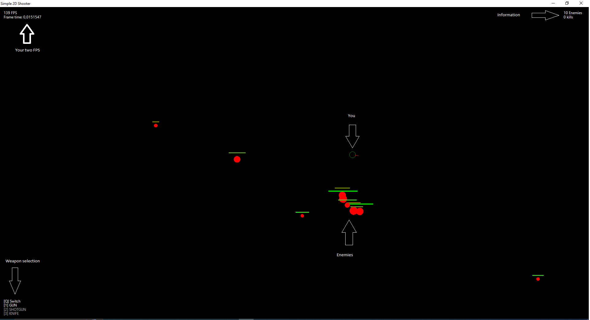

# Simple 2D shooter
Has more game mechanics.

## Player
- 3 weapons (gun/shotgun/knife)
- W.A.S.D movement
- Left mouse button for attack
- Health and running (soon)
- Knife effect and perfect attack

## Weapon
- Knock back
- Damage scaling
- Cooldown
- Bullet speed
- Bullet size

## Enemy
- Health bar
- Assault
- Custom spawn

## GUI
- FPS (rendering), frame time (engine)
- Kill counter for each weapon
- Enemy counter
- Weapon tab

# Requirement
[Visual Studio 2022](https://visualstudio.microsoft.com/ru/vs).\
[NET 9.0](https://dotnet.microsoft.com/en-us/download/dotnet/9.0) or you can change it to 8.0.

# Usage
Download from [releases](https://github.com/Dae-Moon/Simple2DShooter/releases) or compile yourself.\
Run **Simple2DShooter.exe**

## Window

   

